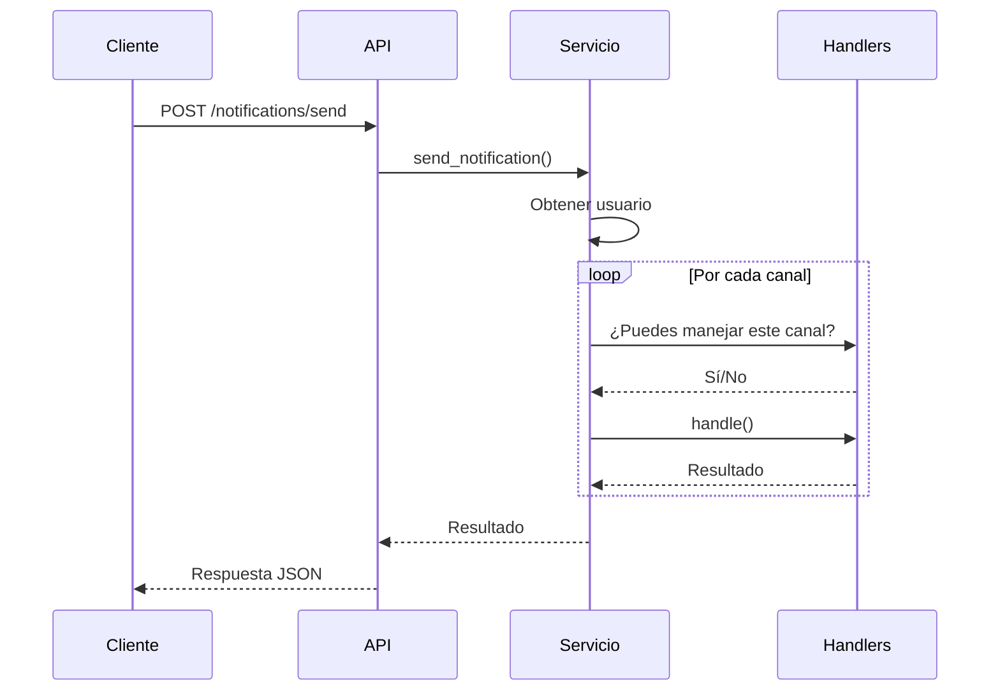

# 📬 Sistema de Notificación Multicanal

**Autor:** [Tu nombre completo]  
**Identificación:** [Tu número de documento]

---

## 🧠 Descripción General

Este proyecto implementa una **API REST** para un sistema de notificaciones multicanal. Los usuarios pueden registrarse con uno o más canales de comunicación (como **email**, **SMS** o **consola**), y el sistema intentará enviar mensajes utilizando su canal preferido, con respaldo automático en caso de fallos.

---

## 🎯 Características Clave

- ✅ Registro de usuarios con canales de contacto preferidos y alternativos.
- ✅ Envío de notificaciones por múltiples canales.
- ✅ Reintentos automáticos mediante el patrón **Chain of Responsibility**.
- ✅ Arquitectura limpia y desacoplada usando el patrón **Hexagonal**.
- ✅ Almacenamiento en memoria (sin base de datos) para facilitar desarrollo y pruebas.
- ✅ Logging de todos los intentos de envío.

---

## 🧱 Arquitectura y Patrones

### 🧩 Hexagonal Architecture (Ports and Adapters)
Permite separar la lógica de negocio de las tecnologías externas como frameworks, almacenamiento o transporte.

### 🔗 Chain of Responsibility
Encadena los canales disponibles para probar uno a uno si ocurre un fallo de envío.

### 🧼 Singleton (Logger)
Asegura que los logs se registren desde un único punto central.

---

## 📡 Endpoints REST

### 1. ➕ Registrar Usuario

`POST /users`

#### Body JSON
```json
{
  "name": "Juan",
  "preferred_channel": "email",
  "available_channels": ["email", "sms"]
}
```

## Ejemplo CURL
```
curl -X POST http://localhost:5000/users -H "Content-Type: application/json" -d "{\"name\":\"Juan\",\"preferred_channel\":\"email\",\"available_channels\":[\"email\",\"sms\"]}"
```

### 2. 📋 Listar Usuarios
`GET /users`

## Ejemplo CURL
```
curl http://localhost:5000/users
```
### 3. 🚀 Enviar Notificación
`POST /notifications/send`

#### Body JSON
```json
{
  "user_name": "Juan",
  "message": "Su cita es mañana",
  "priority": "high"
}
```

## Ejemplo CURL
```
curl -X POST http://localhost:5000/notifications/send -H "Content-Type: application/json" -d "{\"user_name\":\"Juan\",\"message\":\"Su cita es mañana\",\"priority\":\"high\"}"
```

### 🔄 Flujo de Notificaciones
1. El cliente solicita enviar una notificación.

2. El sistema busca al usuario en el repositorio.

3. Intenta enviar usando el canal preferido.

4. Si falla (simulación con random.choice([True, False])), prueba los canales alternativos.

5. Registra cada intento en el log.

6. Devuelve el estado final de la entrega.

### 🧪 Ejemplos de Respuestas
✅ Registro Exitoso

```json
{
  "name": "Juan",
  "preferred_channel": "email",
  "available_channels": ["email", "sms"]
}
```
✅ Notificación Entregada

```json
{
  "user_name": "Juan",
  "message": "Su cita es mañana",
  "priority": "high",
  "status": "DELIVERED",
  "delivered_via": "email"
}

```
❌ Notificación Fallida

```json

  {
  "user_name": "Juan",
  "message": "Su cita es mañana",
  "priority": "high",
  "status": "FAILED (all channels)",
  "delivered_via": null
}
```
## Diagrama de Clases/Modules


### 📈 Diagrama de Flujo



