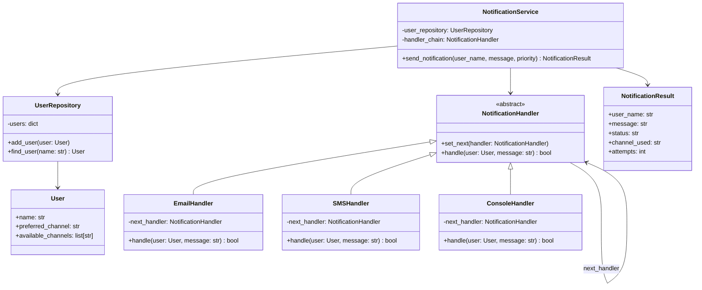
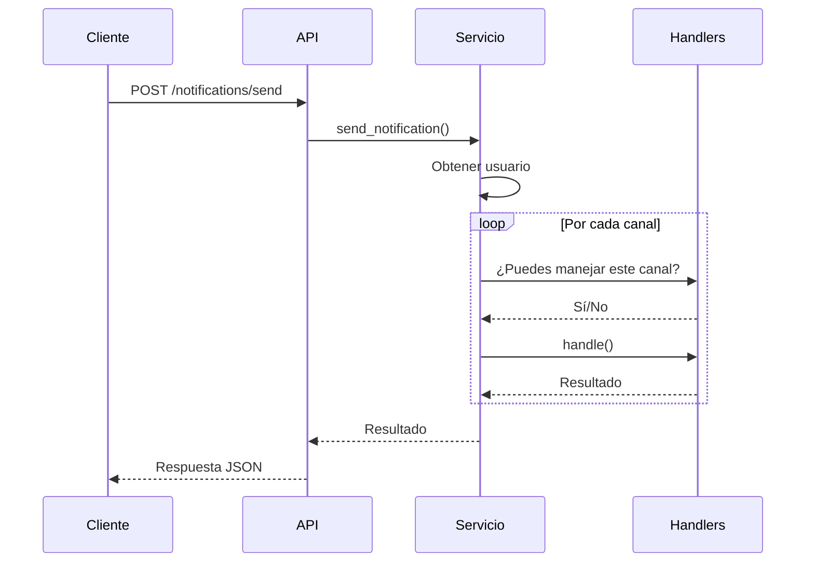

# 📬 Sistema de Notificación Multicanal

**Autor:**  *Erwin Duban Soto Sarmiento*  


---

## 🧠 Descripción General

Este proyecto implementa una **API REST** para un sistema de notificaciones multicanal. Los usuarios pueden registrarse con uno o más canales de comunicación (como **email**, **SMS** o **consola**), y el sistema intentará enviar mensajes utilizando su canal preferido, con respaldo automático en caso de fallos.

---

## 🎯 Características Clave

- ✅ Registro de usuarios con canales de contacto preferidos y alternativos.
- ✅ Envío de notificaciones por múltiples canales.
- ✅ Reintentos automáticos mediante el patrón **Chain of Responsibility**.
- ✅ Arquitectura limpia y desacoplada usando el patrón **Hexagonal**.
- ✅ Almacenamiento en memoria (sin base de datos) para facilitar desarrollo y pruebas.
- ✅ Logging de todos los intentos de envío.

---

## 🧱 Arquitectura y Patrones

### 🧩 Hexagonal Architecture (Ports and Adapters)
Permite separar la lógica de negocio de las tecnologías externas como frameworks, almacenamiento o transporte.

### 🔗 Chain of Responsibility
Encadena los canales disponibles para probar uno a uno si ocurre un fallo de envío.

### 🧼 Singleton (Logger)
Asegura que los logs se registren desde un único punto central.

---

## 📡 Endpoints REST

### 1. ➕ Registrar Usuario

`POST /users`

#### Body JSON
```json
{
    "name": "Pepe",
    "preferred_channel": "sms",
    "available_channels": [
        "email",
        "sms"
    ]
}
```

## Ejemplo CURL
```bash
curl -X POST 'http://localhost:5000/users' \
  -H 'Content-Type: application/json' \
  -d '{
    "name": "Ana",
    "preferred_channel": "sms",
    "available_channels": ["sms", "email"]
  }'
```

### 2. 📋 Listar Usuarios
`GET /users`

## Ejemplo CURL
```
curl http://localhost:5000/users
```
### 3. 🚀 Enviar Notificación
`POST /notifications/send`

#### Body JSON
```json
{
  "user_name": "Juan",
  "message": "Su cita es mañana",
  "priority": "high"
}
```

## Ejemplo CURL
```
curl -X POST http://localhost:5000/notifications/send -H "Content-Type: application/json" -d "{\"user_name\":\"Juan\",\"message\":\"Su cita es mañana\",\"priority\":\"high\"}"
```

### 🧪 Ejemplos de Respuestas
✅ Registro Exitoso
- 201 Created 

```json
{
    "available_channels": [
        "EMAIL",
        "SMS"
    ],
    "name": "Pepe",
    "preferred_channel": "SMS"
}
```
✅ Obtener usuarios
- 200 OK
  
```json
[
    {
        "available_channels": [
            "EMAIL",
            "SMS"
        ],
        "name": "Pepe",
        "preferred_channel": "SMS"
    }
]
```

✅ Notificación Entregada
- 200 OK
  
```json
{
    "delivered_via": "EMAIL",
    "message": "Your appointment is tomorrow",
    "priority": "high",
    "status": "DELIVERED",
    "user_name": "Pepe"
}

``` 
❌ Notificación Fallida
- 404 Not Found (usuario no existe)
- 424 Failed Dependency (todos los canales fallaron)


```json

  {
  "user_name": "Juan",
  "message": "Su cita es mañana",
  "priority": "high",
  "status": "FAILED (all channels)",
  "delivered_via": null
}
```

### 🔄 Flujo de Notificaciones
1. El cliente solicita enviar una notificación.

2. El sistema busca al usuario en el repositorio.

3. Intenta enviar usando el canal preferido.

4. Si falla (simulación con random.choice([True, False])), prueba los canales alternativos.

5. Registra cada intento en el log.

6. Devuelve el estado final de la entrega.
## Diagrama de Clases/Modules




### 📈 Diagrama de Flujo


### Justificación de Patrones de Diseño
1. Chain of Responsibility (Cadena de Responsabilidad)
Aplicación:

En el flujo de notificaciones (Email → SMS → Console)

Ventajas:
- ✅ Desacoplamiento: Cada handler no conoce qué otros handlers existen
- ✅ Flexibilidad: Añadir/eliminar canales sin modificar el código cliente
- ✅ Fallback automático: Si un canal falla, la petición pasa al siguiente

```code
class NotificationHandler(ABC):
    def set_next(self, handler):
        self.next_handler = handler

    def handle(self, user, message):
        if self.can_handle(user):
            return self.send(message)
        elif self.next_handler:
            return self.next_handler.handle(user, message)
```

2. Strategy (Estrategia)
Aplicación:

Selección dinámica del canal preferido vs. canales alternativos

Ventajas:
- ✅ Intercambiable: Cambiar algoritmos en runtime (ej: prioridad baja → email, alta → SMS)
- ✅ Intercambiable: Cambiar algoritmos en runtime (ej: prioridad baja → email, alta → SMS)
- ✅ Testeabilidad: Cada estrategia puede probarse aisladamente

  ```code
  class NotificationStrategy:
    def execute(self, user, message):
        for channel in user.get_channels_in_order():
            if channel.send(message):
                return SuccessResult(channel)
        return FailedResult()
   ```

3. Repository (Repositorio)
Aplicación:

Gestión de usuarios en memoria (UserRepository)

Ventajas:
- ✅ Abstracción: Oculta detalles de almacenamiento (podría cambiarse a DB sin afectar el dominio)
- ✅ Single Responsibility: Centraliza toda lógica de acceso a datos

¿Por qué estos patrones?
Resuelven problemas específicos:

- Chain of Responsibility → Enrutamiento multicanal

- Strategy → Variabilidad en políticas de envío

- Repository → Persistencia desacoplada

- Cumplen principios SOLID:

- Open/Closed: Nuevos canales no modifican código existente

- Dependency Inversion: Depende de abstracciones (handlers, repositorios)

- Escalabilidad:

- Patrones permiten añadir fácilmente:

- Nuevos canales (WhatsApp, push notifications)

- Nuevas estrategias (ej: envío por geolocalización)

###🛠️ Setup del Proyecto: Sistema de Notificación Multicanal
## Requisitos Previos
- Python 3.8+
- pip (gestor de paquetes)

### 1. Clonar el Repositorio

```code
git clone https://github.com/tu-usuario/notification-system.git
cd notification-system
```

### 2. Configurar Entorno Virtual

```code
# Crear entorno virtual (Windows)
python -m venv venv
.\venv\Scripts\activate

# Crear entorno virtual (Linux/MacOS)
python3 -m venv venv
source venv/bin/activate
```

### 3. Instalar Dependencias
```code
pip install -r requirements.txt
```

### Iniciar la Aplicación
```code
flask run --port=5000 --debug
o python main.py 
```
  


